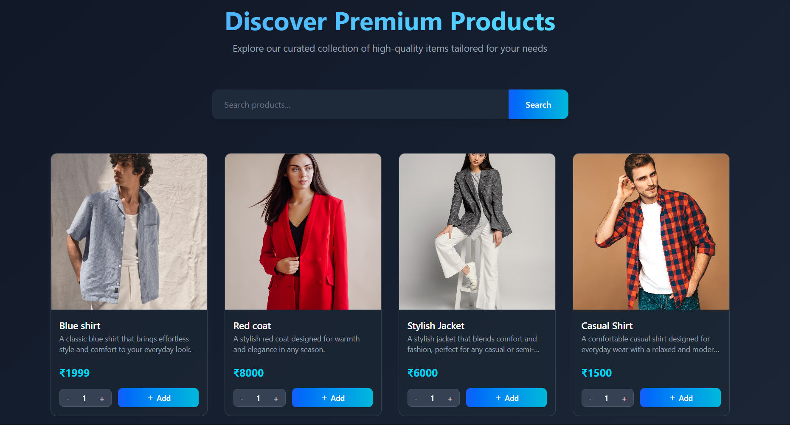
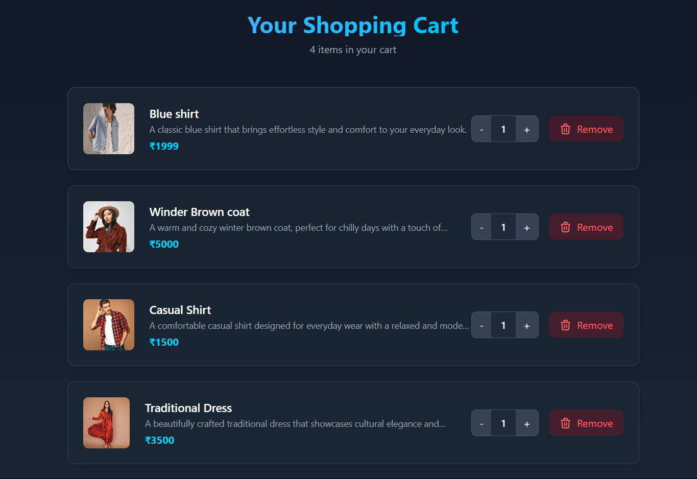

# 🛍️ MERN Stack E-Commerce Store (Clothing)

A full-featured clothing e-commerce web application built using the MERN stack (MongoDB, Express, React, Node.js), offering powerful admin product management, seamless user shopping experience, cloud-based image uploads, and modern UI interactions.

---

## ✨ Features

### 1. 🔧 Admin Product Management

- **Add & Edit Products**  
  Admins can add and update detailed product info:
  - Name, description, price, category
  - Available sizes and colors
  - Multiple image uploads

- **Advanced Image Uploads**
  - Supports `.jpg`, `.jpeg`, `.png` formats
  - Max file size: **15MB**
  - Integrated with **Cloudinary** for scalable cloud image hosting and optimization

- **Delete Products**
  - Automatically removes deleted products from all users’ carts
  - Prevents errors and ensures data integrity

---

### 2. 🛒 User Shopping Experience

- **Product Discovery**
  - Browse all products from the homepage
  - Use a **search bar** to find specific items

- **Detailed Product View**
  - View full details and large images on a dedicated product page

- **Interactive Shopping Cart**
  - Add products to cart from product list or detail view
  - View, update, or remove items from the cart
  - Auto-updated total price

- **Smart UI Feedback**
  - "Add to Cart" button turns to "Added" and disables after adding
  - Toast notifications for actions (add to cart, upload success/error)
  - Loading indicators for image upload and key actions

---

## 🧑‍💻 Tech Stack

### 🔹 Frontend
- **React** – Component-based UI
- **Zustand** – Lightweight global state management
- **React Router** – Page navigation
- **Tailwind CSS** – Modern utility-first styling
- **React Hot Toast** – Clean, non-intrusive notifications

### 🔹 Backend
- **Node.js + Express.js** – RESTful API server
- **MongoDB + Mongoose** – NoSQL database with ODM
- **Multer** – Handles multipart form-data for file uploads
- **Cloudinary** – Cloud storage and delivery of product images

---

## 📦 Project Structure
client/
├── src/
│ ├── components/
│ ├── pages/
│ ├── store/
│ └── App.jsx
server/
├── controllers/
├── models/
├── routes/
├── uploads/
└── server.js
.env
README.md

yaml
Copy
Edit

---

## 🚀 Getting Started

### 📋 Prerequisites

- Node.js and npm
- MongoDB instance (local or cloud via MongoDB Atlas)
- Cloudinary account (for image hosting)

### 🔧 Environment Variables (`.env`)

```env
MONGODB_URI=your_mongo_uri
CLOUDINARY_CLOUD_NAME=your_cloud_name
CLOUDINARY_API_KEY=your_api_key
CLOUDINARY_API_SECRET=your_api_secret
```
🛠️ Install Dependencies
bash
Copy
Edit
# Frontend
cd client
npm install

# Backend
cd ../server
npm install
🏃 Run the Application
bash
Copy
Edit
# Start backend
cd server
npm start

# Start frontend
cd ../client
npm run dev
📌 TODO / Roadmap
✅ Admin product CRUD

✅ Cart system with quantity updates

✅ Cloudinary image uploads

⬜ User authentication & login

⬜ Order checkout & payment integration

⬜ Responsive mobile optimization

⬜ Wishlist & reviews

📸 Screenshots
### 🏠 Home Page


### 🛒 Cart Page


🤝 Contributing
Contributions are welcome! Feel free to open issues or submit pull requests for improvements.

🙌 Acknowledgements
Cloudinary

Mongoose

Zustand

Tailwind CSS
